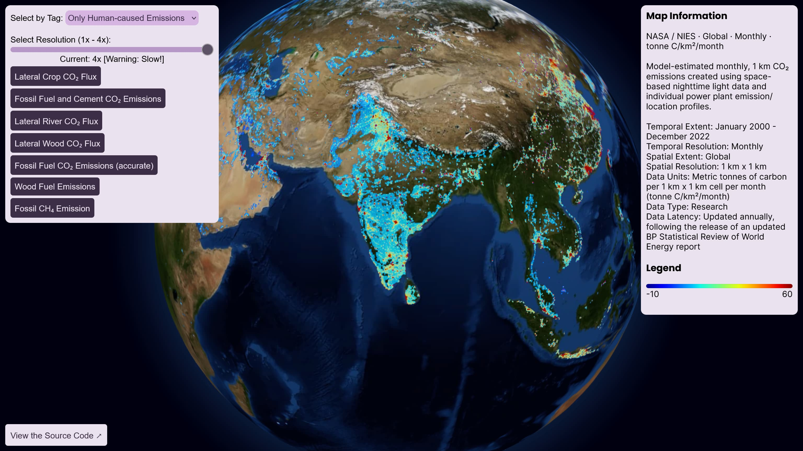

  <a href="[https://aamirazeez.com/story/diffabled](https://aamirazeez.com/ghgscape)">
    
    <h2 align="center">GHGScape</h2>

GHGScape allows to easily differentiate between between natural and anthropgenic emissions. It revolutionizes the way we think about greenhouse gas emissions.

## About
Created for the NASA International Space Apps Challenge.

Visit the team page here:
https://www.spaceappschallenge.org/nasa-space-apps-2024/find-a-team/ghgscape/

Check out GHGScape here:
https://aamirazeez.com/ghgscape

## High-Level Summary
I built GHGScape which provides a visually intuitive way to interpret large and complex datasets, allowing for a clearer understanding of greenhouse gas emissions.

GHGScape fulfills the challenge by mapping both human-caused and natural greenhouse gas emissions all in one web app. It separates the emissions by tags like human-caused, natural or both. Selecting both allows the user to see which source truly contributes to the warming of our planet. GHGScape is important as it shows the real-world impact of human pollution that we don't often get to see firsthand.

## What exactly does it do?

## How does it work?

## What benefits does it have?

## What do you hope to achieve?

## What tools, coding languages, hardware, or software did you use to develop your project?

## Space Agency Data Used
[NASA Resource: Average Dry-Air Column CO₂ (XCO₂)](https://earth.gov/ghgcenter/api/raster/searches/08f476b6d4343d87fce86fc20989abcb/WebMercatorQuad/WMTSCapabilities.xml?assets=xco2&amp;colormap_name=magma&amp;rescale=412%2C422)

[NASA Resource: LNLGIS Net Biosphere Exchange](https://earth.gov/ghgcenter/api/raster/searches/4489b3adb44d1cdf07fdeb0da20380b1/WebMercatorQuad/WMTSCapabilities.xml?assets=lnlgis-nbe&amp;colormap_name=coolwarm&amp;rescale=-1200%2C1200)

[NASA Resource: LNLGIS Net Carbon Exchange](https://earth.gov/ghgcenter/api/raster/searches/4489b3adb44d1cdf07fdeb0da20380b1/WebMercatorQuad/WMTSCapabilities.xml?assets=lnlgis-nce&amp;colormap_name=coolwarm&amp;rescale=-1200%2C1200)

[NASA Resource: LNLGIS Net Land Carbon Stock Loss](https://earth.gov/ghgcenter/api/raster/searches/4489b3adb44d1cdf07fdeb0da20380b1/WebMercatorQuad/WMTSCapabilities.xml?assets=lnlgis-dc-loss&amp;colormap_name=coolwarm&amp;rescale=-600%2C600)

[NASA Resource: Lateral Crop CO₂ Flux](https://earth.gov/ghgcenter/api/raster/searches/4489b3adb44d1cdf07fdeb0da20380b1/WebMercatorQuad/WMTSCapabilities.xml?assets=crop&amp;colormap_name=coolwarm&amp;rescale=-100%2C100)

[NASA Resource: Fossil Fuel and Cement CO₂ Emissions](https://earth.gov/ghgcenter/api/raster/searches/4489b3adb44d1cdf07fdeb0da20380b1/WebMercatorQuad/WMTSCapabilities.xml?assets=ff&amp;colormap_name=purd&amp;rescale=0%2C450)

[NASA Resource: Lateral River CO₂ Flux](https://earth.gov/ghgcenter/api/raster/searches/4489b3adb44d1cdf07fdeb0da20380b1/WebMercatorQuad/WMTSCapabilities.xml?assets=river&amp;colormap_name=coolwarm&amp;rescale=-50%2C50)

[NASA Resource: Lateral Wood CO₂ Flux](https://earth.gov/ghgcenter/api/raster/searches/4489b3adb44d1cdf07fdeb0da20380b1/WebMercatorQuad/WMTSCapabilities.xml?assets=wood&amp;colormap_name=coolwarm&amp;rescale=-100%2C100)

[NASA Resource: Fossil Fuel CO₂ Emissions](https://earth.gov/ghgcenter/api/raster/searches/c5aeaef15499f4f521b198f8a48841c8/WebMercatorQuad/WMTSCapabilities.xml?assets=co2-emissions&amp;colormap_name=jet&amp;rescale=-10%2C60)

[NASA Resource: Net Primary Production](https://earth.gov/ghgcenter/api/raster/searches/055e09c82bf81d02ee96be8565f5bcb8/WebMercatorQuad/WMTSCapabilities.xml?assets=npp&amp;colormap_name=purd&amp;rescale=0%2C8)

[NASA Resource: Heterotrophic Respiration](https://earth.gov/ghgcenter/api/raster/searches/055e09c82bf81d02ee96be8565f5bcb8/WebMercatorQuad/WMTSCapabilities.xml?assets=rh&amp;colormap_name=purd&amp;rescale=0%2C8)

[NASA Resource: Net Ecosystem Exchange](https://earth.gov/ghgcenter/api/raster/searches/055e09c82bf81d02ee96be8565f5bcb8/WebMercatorQuad/WMTSCapabilities.xml?assets=nee&amp;colormap_name=coolwarm&amp;rescale=-4%2C4)

[NASA Resource: Rh + FIRE + FUEL - NPP](https://earth.gov/ghgcenter/api/raster/searches/055e09c82bf81d02ee96be8565f5bcb8/WebMercatorQuad/WMTSCapabilities.xml?assets=nbe&amp;colormap_name=coolwarm&amp;rescale=-4%2C4)

[NASA Resource: Fire Emissions](https://earth.gov/ghgcenter/api/raster/searches/055e09c82bf81d02ee96be8565f5bcb8/WebMercatorQuad/WMTSCapabilities.xml?assets=fire&amp;colormap_name=purd&amp;rescale=0%2C8)

[NASA Resource: Wood Fuel Emissions](https://earth.gov/ghgcenter/api/raster/searches/055e09c82bf81d02ee96be8565f5bcb8/WebMercatorQuad/WMTSCapabilities.xml?assets=fuel&amp;colormap_name=purd&amp;rescale=0%2C0.5)

[NASA Resource: Ensemble Mean Wetland CH₄ Emissions](https://earth.gov/ghgcenter/api/raster/searches/ac178c9e3d4f069d1334475c7febad34/WebMercatorQuad/WMTSCapabilities.xml?assets=ensemble-mean-ch4-wetlands-emissions&amp;colormap_name=magma&amp;rescale=0%2C3e-9)

[NASA Resource: Air-Sea CO₂ Flux](https://earth.gov/ghgcenter/api/raster/searches/e38c1b6e8f3e8f32154dab2e8bbd4e86/WebMercatorQuad/WMTSCapabilities.xml?assets=co2&amp;colormap_name=bwr&amp;rescale=-0.0007%2C0.0002)

[NASA Resource: Priori Total](https://earth.gov/ghgcenter/api/raster/searches/17feb26d25fd90ad87845406aba9955e/WebMercatorQuad/WMTSCapabilities.xml?assets=prior-total&amp;colormap_name=spectral_r&amp;rescale=0%2C0.3)

[NASA Resource: Posterior Total](https://earth.gov/ghgcenter/api/raster/searches/17feb26d25fd90ad87845406aba9955e/WebMercatorQuad/WMTSCapabilities.xml?assets=post-total&amp;colormap_name=spectral_r&amp;rescale=0%2C0.3)

[NASA Resource: Total CH₄ Emission](https://earth.gov/ghgcenter/api/raster/searches/ac83329cc2fe54db02348d6dac313dbc/WebMercatorQuad/WMTSCapabilities.xml?assets=total&amp;colormap_name=purd&amp;rescale=0.48%2C24)

[NASA Resource: Microbial CH₄ Emission](https://earth.gov/ghgcenter/api/raster/searches/ac83329cc2fe54db02348d6dac313dbc/WebMercatorQuad/WMTSCapabilities.xml?assets=microbial&amp;colormap_name=purd&amp;rescale=0.3%2C15)

[NASA Resource: Fossil CH₄ Emission](https://earth.gov/ghgcenter/api/raster/searches/ac83329cc2fe54db02348d6dac313dbc/WebMercatorQuad/WMTSCapabilities.xml?assets=fossil&amp;colormap_name=purd&amp;rescale=0.24%2C12)

[NASA Resource: Pyrogenic CH₄ Emission](https://earth.gov/ghgcenter/api/raster/searches/ac83329cc2fe54db02348d6dac313dbc/WebMercatorQuad/WMTSCapabilities.xml?assets=pyrogenic&amp;colormap_name=purd&amp;rescale=0.032%2C1.6)

[NASA Resource: Population Density](https://earth.gov/ghgcenter/api/raster/searches/822d8911ace54263c201fffc56d8e752/WebMercatorQuad/WMTSCapabilities.xml?assets=population-density&amp;colormap_name=ylorrd&amp;rescale=0%2C1000)
